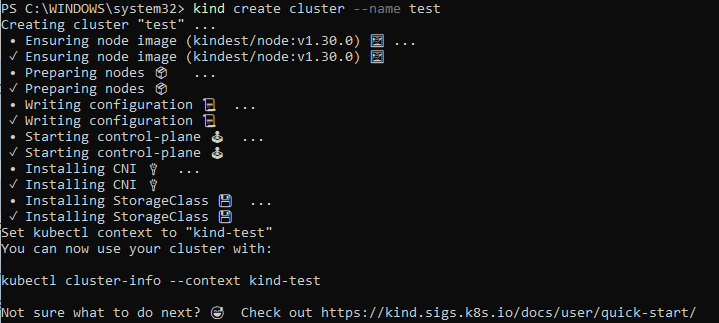

# Criar seu cluster local

Primeiro de tudo, você deverá criar seu cluster local. Temos um artigo nesse [link](https://blog.toolboxdevops.cloud/kubernetes-para-iniciantes-1-primeiros-passos-212ae76544ce) sobre o uso do *kind* para a criação de um cluster local.

### criando o cluster

Uma vez que você seguiu todo o passo a passo de instalção, execute o comando `kind create cluster --name test`



### multi-clusters
Em caso de criação de mais de um cluster:

```
kind create cluster --name kind-ambiente1
kind create cluster --name kind-ambiente2

kind get clusters
```
Para interagir com cada um dos clusters separadamente use o paramentro `--context kind-kind`.

```
kubectl cluster-info --context ambiente1
```

### deletando o cluster

Com o cluster criado, vc pode executar o comando abaixo para remove-lo.

```
kind delete cluster
```