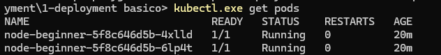

# k8s-exemplos-basicos - Deployment

Neste exemplo, iremos atualizar a fonte de código do nosso deployment.

Neste cenário, a estratégia de rolling-update garante a atualização das pods com 0 _downtime_, garantindo assim que a alteração seja feita de um forma gradual.

Temos o arquivo `deployment.yml`, que contém as informações básicas e necessárias para efetuar o deploymente do nosso container de teste.

## Comandos que iremos utilizar

Para aplicar o deployment dentro do nosso cluster, devemos executar o comando:

```
kubectl apply -f deployment.yml
```


e para _checkar_ o status do nosso deployment, podemos executar o comando

```
kubectl get pods
```



Por último, iremos atualizar o nosso deployment 
```
kubectl set image deployment.v1.apps/node-beginner web-app-container=toolboxdevopsplayground/hello-world-nodejs:1.0.0
```

e para _checkar_ o status do nosso deployment, podemos executar o comando e veremos a troca de containers sendo executada

```
kubectl get pods
```


Neste cenário, mesmo com a imagem causando erro, conseguimos notar que as primeiras pods ainda continuam operacional para manter o sistema em pé.

Para desfazer a alteração, podemos executar o comando
```
kubectl rollout status deployment/node-beginner
```


