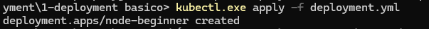

# k8s-exemplos-basicos - Deployment

Neste exemplo, iremos efetuar o primeiro Deploy de exemplo.

Temos o arquivo `deployment.yml`, que contém as informações básicas e necessárias para efetuar o deploymente do nosso container de teste.

## Comandos que iremos utilizar

Para aplicar o deployment dentro do nosso cluster, devemos executar o comando:

```
kubectl apply -f deployment.yml
```


e para _checkar_ o status do nosso deployment, podemos executar o comando

```
kubectl get pods
```


para saber o log da pod, execute

```
kubectl logs --tail=20 <nome-da-pod>
```
